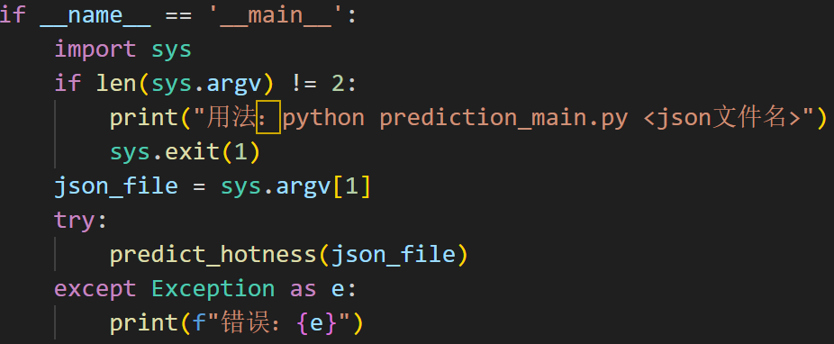

## prediction目录下主要文件：
#### 1.文件夹Hotness：

热度值计算函数Hotness.py（**爬虫端导出的json文件放置其中**）
#### 2.文件夹time_series_prediction：
时间序列预测所使用的一些模型与实现在其中（无需管）
#### 3.time_series.db：
训练数据库，存储历史热度时间序列
#### 4.Historical_data_entry.py：
将爬取历史数据（Hotness文件中的json文件）存储到训练数据库中作为预测模型训练数据（不一定要在外侧使用，可以手动维护，若需调用，需修改其中数据库设置的相对路径，当前路径为\prediction处的相对路径）
#### 5.prediction_model.py：
预测模型的训练，将模型训练结果存储与相对目录下的best_arima_order.pkl文件与lstm_timeseries.h5文件中,**这部分代码若需在转移后使用,必须需修改其中数据库设置的相对路径，当前路径为\prediction处的相对路径**

**两处需要修改的地方**
1.prediction_model.py中的第9行，训练数据库的相对路径关联
2./time_series_prediction/LSTM.py中的main函数，其中144行的训练数据库的相对路径关联与168行的预测模型存储的相对路径关联

#### 6.最重要的-prediction_main.py：

使用方式设计了命令行与函数接口，需预测的json文件放置在Hotness文件夹中，使用时输入相应json文件的文件名（例如 NIS3366.#南大碎尸案#.json），输出结果为三张图片hotness_trend.png,Multi_prediction_result.png,Prediction_result.png.
**同样的，这部分代码若需在转移后使用,必须需修改其中的相对路径，当前路径为\prediction处的相对路径**

**需要修改的地方**

1.三张图片所需的存储位置（prediction_main.py第84行、第150行、第234行）
2.load_model()函数中预测模型的存储位置（prediction_main.py第90行、第94行）

